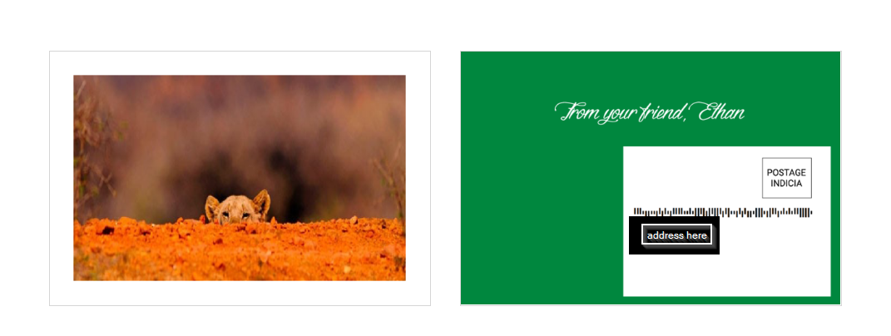

### Tidings

### What is this?
[Tidings](https://tidings-app.netlify.app/) lets you send a postcard with an image in 2 minutes.

Just upload an image, enter a valid US address, and pay to send your card on its way. Easy.

The images above make up an example card -- your image is printed on the front and name on the back.

### How does it work?
The short answer is with [Lob](https://www.lob.com/), a set of APIs for direct mail.

Upon payment, your inputted information is transmitted to Lob which will create and send your postcard. You can expect it to arrive in about 5 - 7 business days.

### Give me more details
A more technical explanation: this app is rendered completely on the client-side and leans on a number of third-party APIs so that no backend is required.

It's written in JavaScript / React -- primarily with functional components and hooks -- to avoid using any state management libraries.

Cloudinary's API helps with storing images, Stripe's with payment processing, and obviously Lob's with actual postcard creation & delivery. The destination form's autocomplete field relies on Google's Places API.

### This is verbose
No worries. Please email me at eleetyson@gmail.com if you found this interesting, useless, or anything in between 👋

\*Trello board: <https://trello.com/b/2D6O1b4S/tidings>\*
